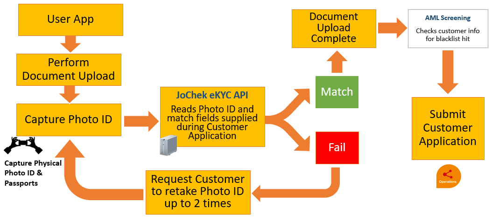
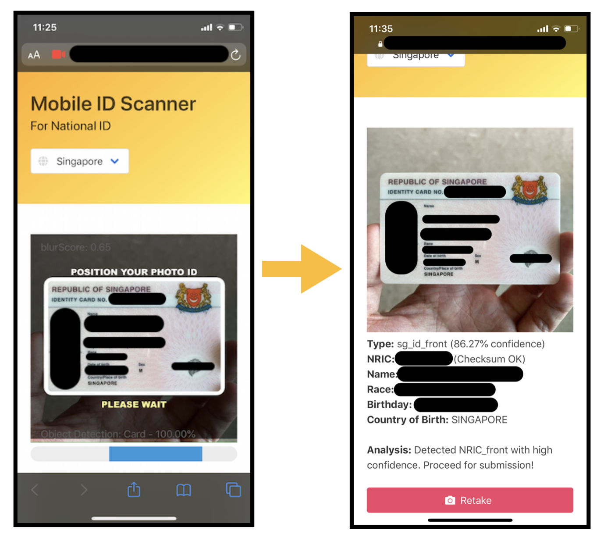

# JoChek eKYC API - Singapore Photo ID
*Updated 8 May 2020*

### 1. Overview

Applications used by customers or insurance agents require **KYC (know your customer)** process as part of the sales flow. During KYC, customers need to provide a Photo ID to match against their provided customer details. The API service automates the process of document check and field validation. 



JoChek eKYC API validates the Photo ID in 4 different areas:

* **Classification**
   * Document type
* **Field Values Extraction**
   * ID Number
   * Name
   * Date of Birth
   * Address
* **Quality Check**
   * Accept or Reject indicator (boolean flag)
* **Keyword Comparison Check**
   * Found or Not Found indicator (boolean flag)

JoChek eKYC API will assess the uploaded image and respond with an accept/reject flag in real time. If the image is **acceptable**, the sales flow proceeds. If **rejected**, the customer is requested to re-upload a new image. JoChek eKYC can be used in tandem with AML (anti money laundering) solutions if required.

### 2. Mobile Web App - Sample

Our [sample mobile web app](https://fwd-idv-live-sg.s3-ap-southeast-1.amazonaws.com/index.html) shows how JoChek eKYC can be incorporated into a mobile setting for scanning of Photo ID.



### 3. Technical Overview

At high level, JoChek eKYC API performs these steps:

1. Front end application makes POST call of (JPEG/PNG) image in **Base64 string** to API
2. Tensorflow image recognition model will then detect the **document type** this image belongs to, either Singapore ID Front/Back and extract OCR values
3. eKYC engine performs custom assessment/scoring and returns an **accept/reject flag** with extracted OCR fields

### 4. General Fields

The API exposes the following general fields to Front End applications for use in business decisioning:

* Singapore ID Side
> prediction.type = "sg_id_front" || "sg_id_back"|| "None_of_the_above"
* Quality Check Acceptance Flag
> qualityCheck.finalDecision = true || false

The fields returned depends on the side of the ID, whether it is front (sg_id_front) or back (sg_id_back).
| Fields Extracted | Front | Back |
|------------------|--------|--------|
| ID Number        | Yes    | Yes    |
| Checksum Validity| Yes    | Yes    |
| Date of Birth    | Yes    | No     |
| Country of Birth | Yes    | No     |
| Address          | No    | Yes     |
| Date of Issue    | No    | Yes     |

### 5. ID Front Side Fields

Fields either have a value or no value (marked as "undefined"):

* ID Number
> vision.extract.idNum = "undefined" || "S1234567Z"
* Is ID Number Checksum Valid?
> vision.extract.isIdNum = true || false
* Date Of Birth
> vision.extract.dob = "undefined" || "DD-MM-YYYY"
* Country Of Birth
> vision.extract.countryOfBirth = "undefined" || "SINGAPORE" || "OTHERS"

### 6. ID Back Side Fields

Fields either have a value or no value (marked as "undefined"):

* ID Number
> vision.extract.idNum = "undefined" || "S1234567Z"
* Is ID Number Checksum Valid?
> vision.extract.isIdNum = true || false
* Address
> vision.extract.address = "undefined" || "510 UPPER CHANGI ROAD"
* Date of Issue
> vision.extract.issueDate = "undefined" || "DD-MM-YYYY"

### 7. API Usage

A demo API endpoint has been created for test usage:
> https://niw1itg937.execute-api.ap-southeast-1.amazonaws.com/Prod/verify

Usage of the API requires an **API key**, which you can obtain from FWD Innovation Kitchen or the referral party who is sharing this documentation.

You can test the demo API with the following:
- [POSTMAN](https://www.getpostman.com/downloads/) or terminal
- **JPG/PNG** file converted to [Base64 String](https://www.base64-image.de)

The demo API accepts the following CURL call of a JSON object containing the *base64image* string:
```bash
POST /Prod/verify HTTP/1.1
Host: xxx.execute-api.ap-southeast-1.amazonaws.com
Content-Type: application/json
x-api-key: [replace with key]

{
	"base64image":"/9j/4AAQSkZJRgABAgEASABIAAD/4...[use sample image]...x44tXCLZyUAGsagb+of1+ntOaFhqwP8AVw6dWlMfFTr/2Q=="
}
```

### 8. API Response (Reject, Out of Type)

An image that is not Singapore ID responds with the following:

```js
{
  "fileName": "nil",
  "fileSize": 21242,
  "fileType": "image/jpeg",
  "prediction": {
    "type": "None_of_the_above",
    "confidence": 0.9199686274509803
  },
  "vision": {
    "type": "No Results",
    "extract": {
      "type": "None_of_the_above"
    }
  },
  "qualityCheck": {
    "passMatchType": false,
    "passConfidenceScore": false,
    "passFieldsCheck": false,
    "passIdNumCheck": false,
    "passResolutionCheck": true,
    "weakPass": false,
    "strongPass": false,
    "height": 255,
    "width": 400,
    "finalDecision": false
  }
}
```

The **prediction.type** and **vision.type** indicators both return "None_of_the_above" when the image submitted is not a valid Singapore ID. The confidence of this assessment is **91.99%**. Confidence which are **above 75%** are considered as sufficiently strong and calculated by the **finalDecision** variable which shows as *false*.

## When **finalDecision** is *false*, the front end application should reject the image

### 9. API Response (Reject, In Type)

An image that is Singapore ID of bad quality responds with the following:

```js
{
  "fileName": "abc.tiff",
  "fileSize": 37229,
  "fileType": "image/tiff",
  "prediction": {
    "type": "sg_id_back",
    "confidence": 0.9896764159202576
  },
  "vision": {
    "type": "No Results",
    "extract": {
      "type": "None_of_the_above"
    }
  },
  "qualityCheck": {
    "passMatchType": false,
    "passConfidenceScore": true,
    "passFieldsCheck": false,
    "passIdNumCheck": false,
    "passResolutionCheck": false,
    "weakPass": false,
    "strongPass": false,
    "height": 146,
    "width": 261,
    "finalDecision": false
  }
}
```

The **prediction.type** and **vision.type** indicators both disagree. Only the former returns "sg_id_back" but the latter returns "No Results". The confidence of **prediction.type** assessment is **98.9%**. Confidence which are **above 75%** are considered as sufficiently strong.

The API consists of an OCR "vision" component that attempts to read the ID and fetch mandatory fields like "idNum" (ID Number). Here, the OCR component is unable to fetch the required fields, and is therefore calculated by **finalDecision** as poor quality.

## When **finalDecision** is *false*, the front end application should reject the image

### 10. API Response (Accept, In Type)

An image that is Singapore ID of good quality responds with the following:

```js
{
  "fileName": "nil",
  "fileSize": 21269,
  "fileType": "image/jpeg",
  "prediction": {
    "type": "sg_id_front",
    "confidence": 0.8588235294117647
  },
  "vision": {
    "type": "sg_id_front",
    "extract": {
      "name": "YU HAO",
      "race": "CHINESE",
      "dob": "27-08-1979",
      "idNum": "S7877669F",
      "isIdNum": true,
      "countryOfBirth": "SINGAPORE"
    }
  },
  "qualityCheck": {
    "passMatchType": true,
    "passConfidenceScore": true,
    "passFieldsCheck": true,
    "passIdNumCheck": true,
    "passResolutionCheck": true,
    "weakPass": true,
    "strongPass": true,
    "height": 715,
    "width": 1168,
    "finalDecision": true
  }
}
```

The **prediction.type** and **vision.type** indicators both return "sg_id_front" when the image submitted is a valid Singapore ID front side. The confidence of this assessment is **85.8%**. Confidence which are **above 75%** are considered as sufficiently strong and calculated by the **finalDecision** variable which shows as *true*.

The API consists of an OCR "vision" component that attempts to read the ID and fetch fields like "dob" (date of birthday) and "idNum" (ID Number). Here, the "dob" and "idNum" are available to be extracted. When available, the fields can be used to auto-populate or display to customer in the front end application.

## When **finalDecision** is *true*, the front end application should accept the image

### 11. Quality Check

The finalDecision boolean returns true when all the following checks pass:

| Check Type | Rule |
|------------------|--------|
| passMatchType       | prediction.type == vision.type      |
| passConfidenceScore | prediction.score > 0.75             |
| passFieldsCheck     | vision.extract.quality.bad == false |
| passIdNumCheck      | vision.extract.isIdNum == true      |
| passResolutionCheck | (height > 150) && (width > 150)     |

If any of these checks fail, the finalDecision boolean returns false.

### 12. Keyword Comparison Search

During the customer application, customers will provide values such as idNum and name which need to be compared against the respective values found in the image. This can be done using the keyword search functionality which will return the closest match candidate and a similarity score for that keyword.

The frontend application can use the similarity score and closest candidate to determine whether to proceed with the application flow.

A search can be requested by adding the *keywords* object into the POST request:

```bash
POST /Prod/verify HTTP/1.1
Host: xxx.execute-api.ap-southeast-1.amazonaws.com
Content-Type: application/json
User-Agent: PostmanRuntime/7.17.1
Accept: */*
Cache-Control: no-cache
Host: xxx.execute-api.ap-southeast-1.amazonaws.com
Accept-Encoding: gzip, deflate
Content-Length: 28345
Connection: keep-alive
cache-control: no-cache

{
  "keywords": {idNum: "S1234567Z", name: "JOHN KEYNES"},
	"base64image":"/9j/4AAQSkZJRgABAgEASABIAAD/4...[use sample image]...x44tXCLZyUAGsagb+of1+ntOaFhqwP8AVw6dWlMfFTr/2Q=="
}
```

### 13. Keyword Comparison Result (Keywords Not Found)

When exact matches of the provided keywords are not found, the following is returned:

```js
{
  "fileName": "nil",
  "fileSize": 21269,
  "fileType": "image/jpeg",
  "prediction": {
    "type": "sg_id",
    "confidence": 0.8588235294117647
  },
  "vision": {
    "type": "sg_id",
    "extract": {
      "name": "YU HAO",
      "race": "CHINESE",
      "dob": "27-08-1989",
      "idNum": "S8877669F",
      "isIdNum": true,
      "countryOfBirth": "MALAYSIA",
      "keywords": {
        "idNum": {
          "target": "S1234567Z",
          "candidate": "S8877669F",
          "score": 44,
          "passThreshold": false
        },
        "name": {
          "target": "JOHN KEYNES",
          "candidate": "CHINESE",
          "score": 44,
          "passThreshold": false
        }
      }
    }
  },
  "qualityCheck": {
    "passMatchType": true,
    "passConfidenceScore": true,
    "passFieldsCheck": true,
    "passIdNumCheck": true,
    "passResolutionCheck": true,
    "weakPass": true,
    "strongPass": true,
    "height": 715,
    "width": 1168,
    "finalDecision": true
  }
}
```

Keyword search results are returned within the **vision.extract.keywords** object. In the case of **idNum** and **name** indicators, both returned LOW similarity match scores of 44 (out of scale of 1-100). Similarity match scores require a threshold of **above 90** to be considered highly similar. Therefore the corresponding **passThreshold** variables show as *false* to indicate that no similar matches were found for these keywords.

### 14. Keyword Comparison Result (Exact/Similar Keywords Found)

When exact or highly similar matches of the provided keywords are found, the following is returned:

```js
{
  "fileName": "nil",
  "fileSize": 21269,
  "fileType": "image/jpeg",
  "prediction": {
    "type": "sg_id",
    "confidence": 0.8588235294117647
  },
  "vision": {
    "type": "sg_id",
    "extract": {
      "name": "YU HAO",
      "race": "CHINESE",
      "dob": "27-08-1989",
      "idNum": "S8877669F",
      "isIdNum": true,
      "countryOfBirth": "MALAYSIA",
      "keywords": {
        "idNum": {
          "target": "S8877669F",
          "candidate": "S8877669F",
          "score": 100,
          "passThreshold": true
        },
        "name": {
          "target": "YU HAO",
          "candidate": "YU HAO",
          "score": 100,
          "passThreshold": true
        }
      }
    }
  },
  "qualityCheck": {
    "passMatchType": true,
    "passConfidenceScore": true,
    "passFieldsCheck": true,
    "passIdNumCheck": true,
    "passResolutionCheck": true,
    "weakPass": true,
    "strongPass": true,
    "height": 715,
    "width": 1168,
    "finalDecision": true
  }
}
```

Keyword search results are returned within the **vision.extract.keywords** object. In the case of **idNum** and **name** indicators, both returned HIGH similarity match scores of 100 (out of scale of 1-100). Similarity match scores require a threshold of **above 90** to be considered highly similar. Therefore the corresponding **passThreshold** variables show as *true* to indicate that exact matches were found for these keywords.

### 15. Business Enquiries

JoChek eKYC API system can be used to perform real-time validation of photo ID image and audit customer inputs. JoChek eKYC is also available for IDs of the following document types:

- Singapore NRIC
- Malaysia MyKad
- Thailand ID
- Hong Kong ID
- Philippines UMID
- Vietnam ID
- International Passport (TD3 compliant)

You can reach out to us at innovation@fwd.com for business enquiries and test keys.